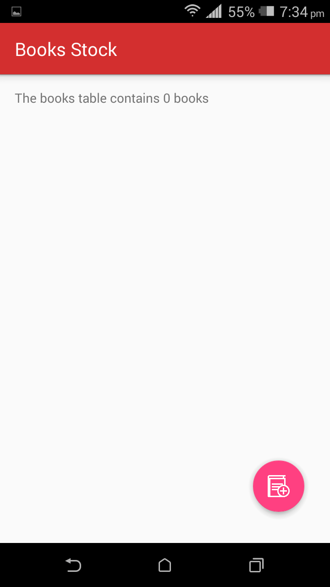
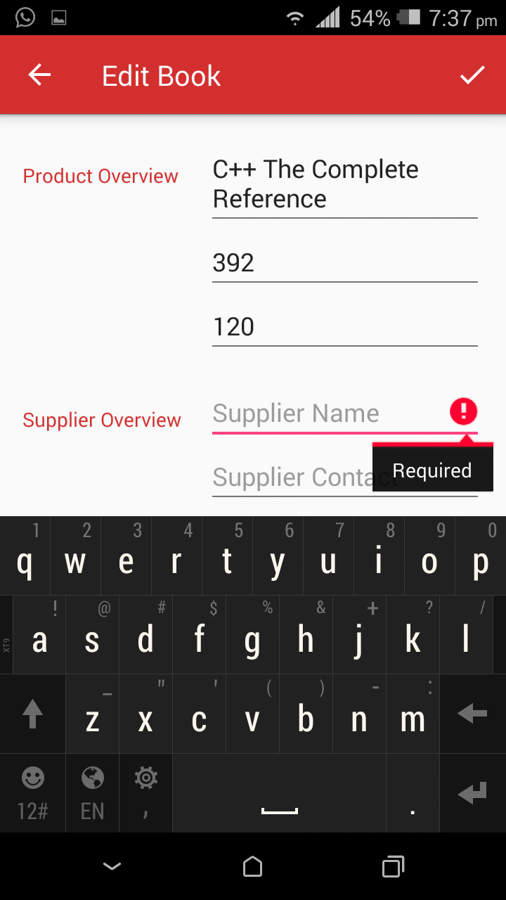
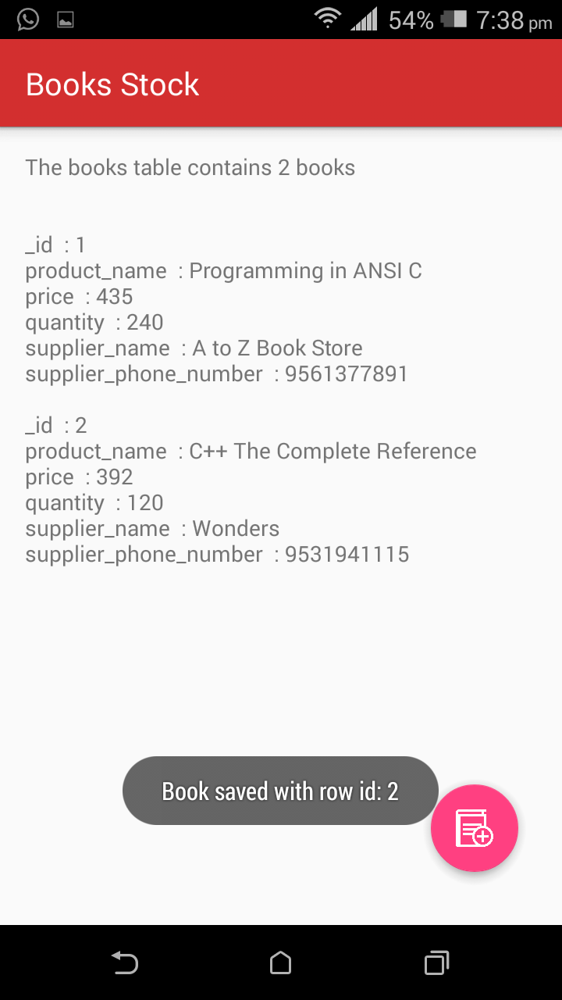
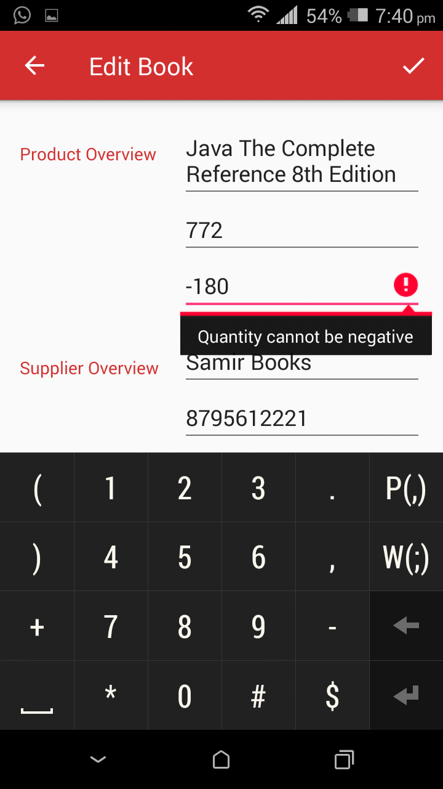
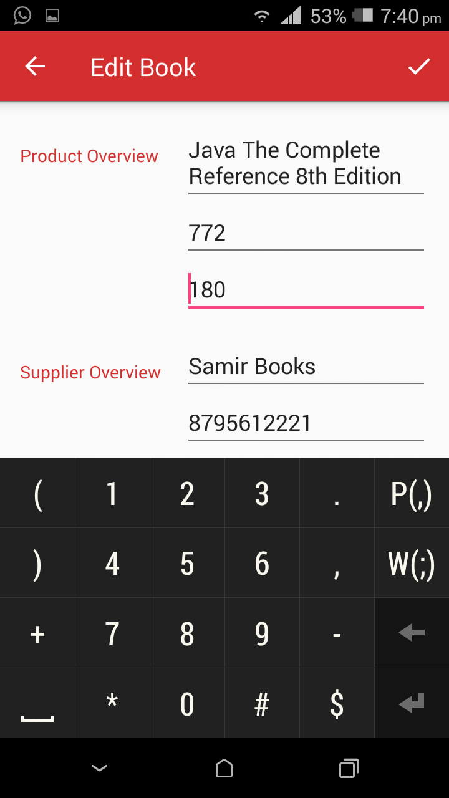
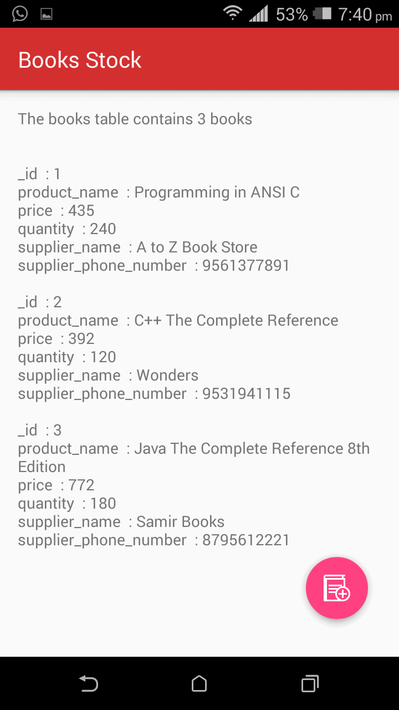

# Udacity and Google India Scholarship Program
## Android Basics Nanodegree Project 8 "Inventory App, Stage 1"
## Name of App - "Books Stock"

<b>PROJECT SPECIFICATION</b>

1. No UI is required for this project.

2. Hint: At minimum, you will need a main activity that has methods to read data, a Contract Java class, and a DbHelper Java class.

3. Note: Even though UI is not required for this Stage, we highly recommend that you test your insert/read methods with log calls. Often, students do not realize their code has SQL syntax errors until the app is run and the methods are called which results in the project not passing.

4. The code compiles without errors.

5. There exists a contract class that defines name of table and constants. 
   Inside the contract class, there is an inner class for each table created. 
   The contract contains at minimum constants for the Product Name, Price, Quantity, Supplier Name, and Supplier Phone Number.

6. There exists a subclass of SQLiteOpenHelper that overrides onCreate() and onUpgrade().

7. There is a single insert method that adds:
    - Product Name
    - Price
    - Quantity
    - Supplier Name
    - Supplier Phone Number
    
    It is up to you to decide what datatype (e.g. INTEGER, STRING) each of these values should be; however, it is required that there are at least 2 different datatypes (e.g. INTEGER, STRING).

8. There is a single method that uses a Cursor from the database to perform a query on the table to retrieve at least one column of data. Also the method should close the Cursor after it's done reading from it.

9. The intent of this project is to give you practice writing raw Java code using the necessary classes provided by the Android framework; therefore, the use of external libraries for the core functionality will not be permitted to complete this project.

10. Code is easily readable such that a fellow programmer can understand the purpose of the app.

11. All variables, methods, and resource IDs are descriptively named such that another developer reading the code can easily understand their function.

12. The code is properly formatted i.e. there are no unnecessary blank lines; there are no unused variables or methods; there is no commented out code. The code also has proper indentation when defining variables and methods.

<b>About Books Stock</b>

User can add Book details(Product Name, Product Price, Product Quantity, Supplier Name, Supplier Contact Number) using EditorActivity
and successful addition of book will be displayed in CatalogActivity.   
NOTE: All fields are mandatory and must be populated by user.

## Books Stock App Images
 
  
 

Check out more images in BooksStockImages folder.
